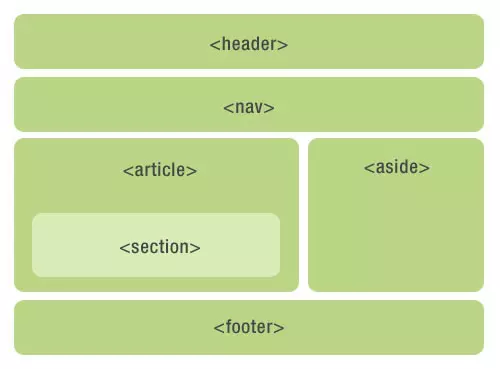

标签语义化有助于构架良好的HTML结构，有利于搜索引擎的建立索引、抓取。也有利于不同设备的解析（屏幕阅读器，盲人阅读器等）。同时，有利于构建清晰的结构，有利于团队的开发、维护。所以，在日常开发中，保持使用合适的标签还是非常有必要的。



```html
<body>
  <header>
    <h1>title</h1>
    <nav>
      <ul>
        <li><a href="/">Home</a></li>
        <li><a href="/events">Current Events</a></li>
      </ul>
    </nav>
  </header>

  <main>
    <article>
     <header>
      <h1>Demos in Exampland</h1>
      <p>Written by A. N. Other.</p>
     </header>
     <nav>
      <ul>
       <li><a href="#public">Public demonstrations</a></li>
       <li><a href="#destroy">Demolitions</a></li>
      </ul>
     </nav>
     <div>
      <section id="public">
       <h1>Public demonstrations</h1>
       <p>...more...</p>
      </section>
      <section id="destroy">
       <h1>Demolitions</h1>
       <p>...more...</p>
      </section>
     </div>
     <footer>
      <p><a href="?edit">Edit</a> | <a href="?delete">Delete</a> | <a href="?Rename">Rename</a></p>
     </footer>
    </article>
  </main>
 
  <footer>
    <p><small>© copyright 1998 Exampland Emperor</small></p>
  </footer>
</body>
```

### html5新标签

| 类型   | 标签            | 描述
:-----  |:-----          |:---
脚本     | `<template>`   |  通过 JavaScript 在运行时实例化内容的容器。
章节     | `<section>`    |  定义文档中的一个章节。
--      | `<nav>`        |  定义只包含导航链接的章节。
--      | `<article>`    |  定义可以独立于内容其余部分的完整独立内容块。
--      | `<aside>`      |  定义和页面内容关联度较低的内容——如果被删除，剩下的内容仍然很合理。
--      | `<header>`     |  定义页面或章节的头部。它经常包含 logo、页面标题和导航性的目录。
--      | `<footer>`     |  定义页面或章节的尾部。它经常包含版权信息、法律信息链接和反馈建议用的地址。
--      | `<main>`       |  定义文档中主要或重要的内容。
组织内容 | `<figure>`      |  代表一个和文档有关的图例。
--      | `<figcaption>` |  代表一个图例的说明。
文字形式 | `<data>`       |  关联一个内容的机器可读的等价形式 （该元素只在 WHATWG 版本的 HTML 标准中，不在 W3C 版本的 HTML5 标准中）。
--      | `<time>`       |  代表日期 和时间 值；机器可读的等价形式通过 datetime 属性指定。
--      | `<mark>`       |  代表一段需要被高亮的引用 文字。
--      | `<ruby>`       |  代表被ruby 注释 标记的文本，如中文汉字和它的拼音。
--      | `<rt>`         |  代表ruby 注释 ，如中文拼音。
--      | `<rp>`         |  代表 ruby 注释两边的额外插入文本 ，用于在不支持 ruby 注释显示的浏览器中提供友好的注释显示。
--      | `<bdi>`        |  代表需要脱离 父元素文本方向的一段文本。它允许嵌入一段不同或未知文本方向格式的文本。
--      | `<wbr>`        |  代表建议换行 (Word Break Opportunity) ，当文本太长需要换行时将会在此处添加换行符。
嵌入内容 | `<embed>`      |  代表一个嵌入 的外部资源，如应用程序或交互内容。
--      | `<video>`      |  代表一段视频 及其视频文件和字幕，并提供了播放视频的用户界面。
--      | `<audio>`      |  代表一段声音 ，或音频流 。
--      | `<source>`     |  为 `<video>` 或 `<audio>` 这类媒体元素指定媒体源 。
--      | `<track>`      |  为 `<video>` 或 `<audio>` 这类媒体元素指定文本轨道（字幕） 。
--      | `<canvas>`     |  代表位图区域 ，可以通过脚本在它上面实时呈现图形，如图表、游戏绘图等。
--      | `<svg>`        |  定义一个嵌入式矢量图 。
--      | `<math>`       |  定义一段数学公式 。
表单     | `<datalist>`   |  代表提供给其他控件的一组预定义选项 。
--      | `<keygen>`     |  代表一个密钥对生成器 控件。
--      | `<output>`     |  代表计算值 。
--      | `<progress>`   |  代表进度条 。
--      | `<meter>`      |  代表滑动条 。
交互元素 | `<details>`     |  代表一个用户可以(点击)获取额外信息或控件的小部件 。
--      | `<summary>`     |  代表 `<details>`  元素的综述 或标题 。
--      | `<menuitem>`    |  代表一个用户可以点击的菜单项。
--      | `<menu>`        |  代表菜单。

[参考MDN](https://developer.mozilla.org/zh-CN/docs/Web/Guide/HTML/HTML5/HTML5_element_list)
[参考其他](https://html.spec.whatwg.org/multipage/sections.html#the-nav-element)

附：
```js
// 抓取MDN页面内容的代码
document.querySelectorAll('img').forEach((item,index) => {
  if (item.parentNode.previousSibling.childNodes[0]) {
    console.log(
      item.parentNode.previousSibling.childNodes[0].textContent,
      item.parentNode.parentNode.nextSibling.nextSibling.textContent
    )
  } else if (
    item.parentNode.previousSibling.previousSibling
    && item.parentNode.previousSibling.previousSibling.childNodes[0]
  ) {
    console.log(
      item.parentNode.previousSibling.previousSibling.childNodes[0].textContent,
      item.parentNode.parentNode.nextSibling.nextSibling.textContent
    )
  }
})
```
