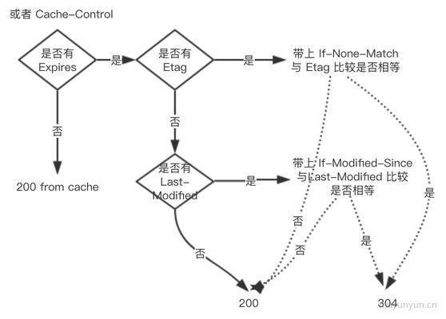

### 浏览器输入url到看到页面的流程
* DNS解析
  - DNS服务器对域名解析，得到目标服务器的IP后，进行HTTP访问
* ↓
* 应用层【HTTP数据】
* ↓
* 传输层【TCP协议：确保可靠性】
  - 为了传输方便，在传输层（TCP 协议）把从应用层处收到的数据（HTTP 请求报文）进行分割，并在各个报文上打上标记序号及端口号后转发给网络层。
  - 三次握手🤝
    - 握手过程中使用了TCP的标志 [flag] —— SYN [synchronize] 和 ACK [acknowledgement]
        - 发送端首先发送一个带 SYN 标志的数据包给对方。
        - 接收端收到后，回传一个带有 SYN/ACK 标志的数据包以示传达确认信息。
        - 最后，发送端再回传一个带 ACK 标志的数据包，代表“握手”结束。若在握手过程中某个阶段莫名中断，TCP 协议会再次以相同的顺序发送相同的数据包。 
  - 除了上述三次握手，TCP 协议还有其他各种手段来保证通信的可靠性
* ↓
* 网络层【IP协议：负责传输、ARP协议：地址解析协议】
  - 增加作为通信目的地的 MAC 地址
  - ARP 是一种用以解析地址的协议，根据通信方的 IP 地址就可以反查出对应的 MAC 地址
* ↓
* 数据链路层
* ↓
* 服务器
  - 数据链路层接收，按序往上层发送，并把对应的首部消去，TCP按序重组请求报文，HTTP处理请求，返回响应
* ↓
* 处理请求，返回响应内容
* ↓
* 浏览器得到资源内容/报文，进行解析渲染
  * 检查HTML并构建DOM
    - 字节 -> 字符串 -> node -> DOM
  * 检查CSS并构建CSSOM【CSS Object Model，是一个建立在web页面上的 CSS 样式的映射】
    - 字节 -> 字符串 -> node -> DOM
  * Web浏览器将DOM和CSSOM结合，并构建出渲染树（render tree）
    - 包含节点和节点样式信息
  * 渲染引擎根据 RenderTree 开始渲染和展示
    - 布局（回流）：确定节点位置和大小
    - 绘制：调用CPU，合成图层，显示与屏幕
  * 遇到 script、link 会阻塞
* 断开连接，四次挥手👋

 

 

### 协议对应OSI七层模型位置：
* 物理层
* 数据链路层
* 网络层
  - IP
* 传输层
  - TCP
  - UDP(User Data Protocal): 用户数据报协议
    - 不可靠，可能丢包而且包的顺序性也不能保证
* 会话层
* 表示层
* 应用层
  - http

### 重绘、回流有什么区别？
* 网页生成时，至少会渲染一次，在用户访问过程中，还会不断重新渲染
* 重绘是当节点需要更改外观而不影响布局，如：color的改变
* 回流是布局或者几何属性的改变，如：width、height的改变
* 回流必定发生重绘，重绘未必引发回流

### async 和 defer 有什么区别？
* async 如果已经加载好，就会开始执行
* defer 不阻塞 HTML 的解析，HTML解析完后，再执行
* 加载多个JS脚本，async无序加载，而defer有序加载
  - 如加载 谷歌统计代码，使用async
  - 加载 JS相互依赖代码，使用defer，如 jQuery.js、jQuery-plugin.js

### 为什么操作DOM慢？
* 相当于不同线程之间的通信
* 可能带来重绘、回流

### 强缓存和协商缓存
> 强缓存是不经过服务器的, 协商缓存是经过服务器的

> 强缓存可能从本地内存获取，也可能从本地磁盘内读取

* 强缓存相关字段(Expires(响应头), Cache-Control(响应头)),
  > Cache-Control优先级大于Expires
  - Cache-Control 
    - no-cache：强制向源服务器再次验证
    - no-store：不缓存请求或响应的任何内容，**这才是真的'no-cache'不缓存**
    - ...
* 协商缓存相关字段(Last-Modified(响应头), If-Modified-Since(请求头), Etag(响应头), If-None-Match(请求头))

HTTP 缓存机制流程图:

### 为什么建立连接是三次握手，而关闭连接却是四次挥手呢？
这是因为服务端在LISTEN状态下，收到建立连接请求的SYN报文后，把ACK和SYN放在一个报文里发送给客户端。而关闭连接时，当收到对方的FIN报文时，仅仅表示对方不再发送数据了但是还能接收数据，己方也未必全部数据都发送给对方了，所以己方可以立即close，也可以发送一些数据给对方后，再发送FIN报文给对方来表示同意现在关闭连接，因此，己方ACK和FIN一般都会分开发送。

[参考-图解HTTP](https://book.douban.com/subject/25863515/)
[参考-Introduction to the CSS Object Model](https://varvy.com/performance/cssom.html)
[参考-掘金文章-深入浅出浏览器渲染原理](https://juejin.im/post/5c24d736f265da614b120d4a)
[参考-掘金文章-TCP的三次握手四次挥手](https://juejin.im/post/5a0444d45188255ea95b66bc)
[参考-segmentfault文章-从URL输入到页面展现到底发生什么？](https://segmentfault.com/a/1190000017184701)
[参考-github.com/MuYunyun/blog](https://github.com/MuYunyun/blog/blob/master/BasicSkill/http/http.md)

ARP协议相关资料：[ARP协议百度百科](https://baike.baidu.com/item/ARP/609343)
